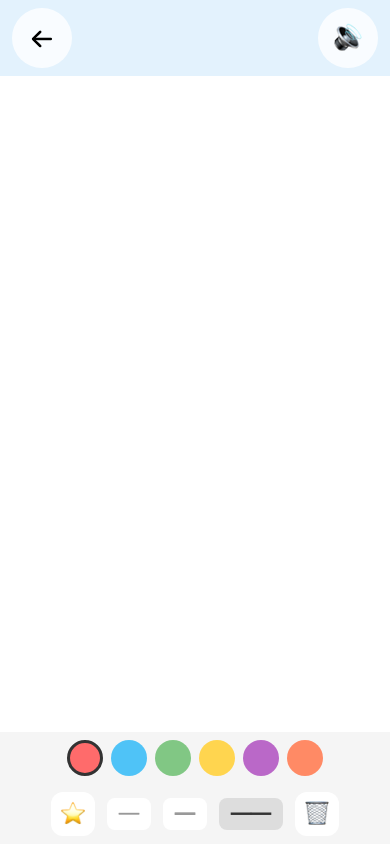
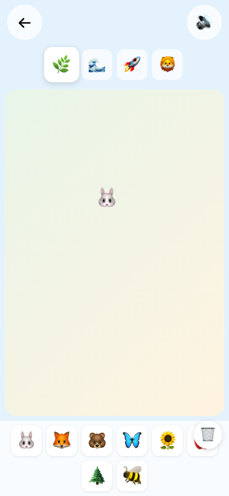
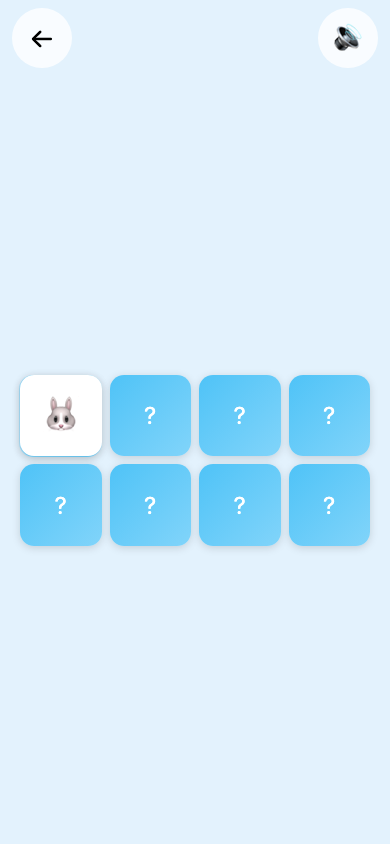
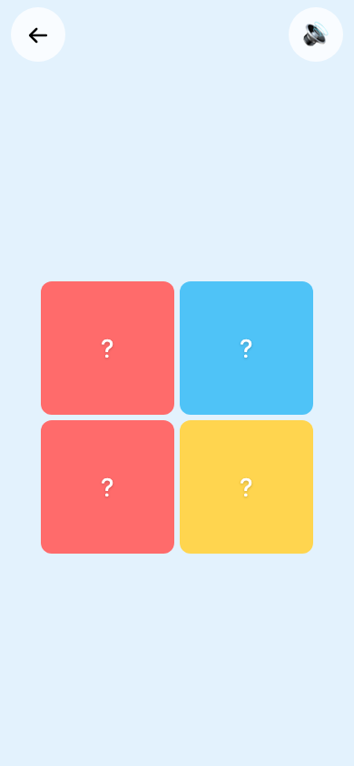
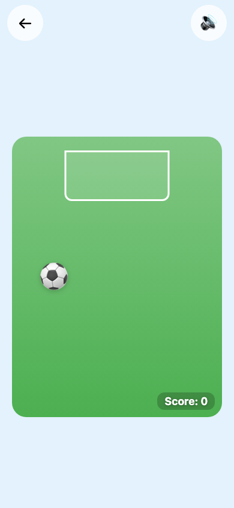

# Kids Games

8 touch games for ages 2-5, inspired by McDonald's Italy in-store displays. Built as a PWA with SvelteKit.

## Games

| | |
|---|---|
| 🎨 **Paint** | 🌟 **Stickers** |
|  |  |
| 🧠 **Memory** | 🧩 **Puzzle** |
|  |  |
| 🫧 **Pop** | ⚽ **Soccer** |
|  |  |
| 📦 **Sorting** | 🌈 **Splash** |
|  |  |

## Development

```sh
pnpm install
pnpm dev
```

## Scripts

| Command | Description |
|---------|-------------|
| `pnpm dev` | Start dev server |
| `pnpm build` | Build for production |
| `pnpm preview` | Preview production build |
| `pnpm check` | Svelte type check |
| `pnpm lint` | Svelte lint |
| `pnpm test` | Unit + behavioral tests (vitest) |
| `pnpm test:e2e` | E2E tests (Playwright, headless) |
| `pnpm test:e2e:headed` | E2E tests with browser visible |
| `pnpm test:all` | All tests |

## Stack

- **Framework:** Svelte 5 + SvelteKit
- **PWA:** vite-plugin-pwa (offline support)
- **Audio:** Web Audio API (synth sounds)
- **Testing:** Vitest + Playwright
- **Deploy:** Vercel (static export)

## Age Scaling

Each game adapts to the child's age (2-5):
- **Age 2:** Big targets, 2-3 items, simple rules, always succeeds
- **Age 5:** More items, faster pace, actual challenge
